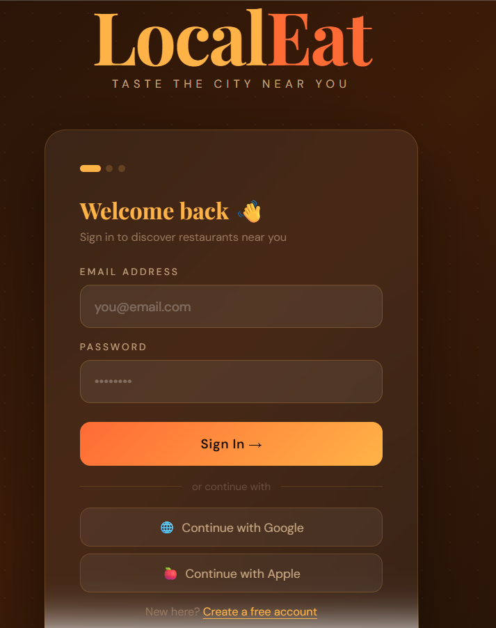
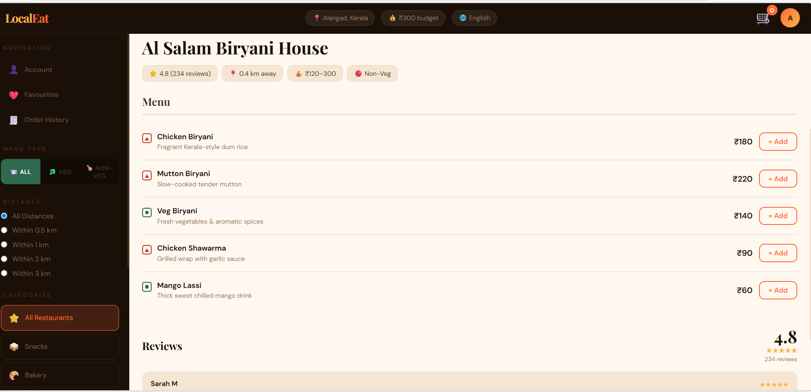
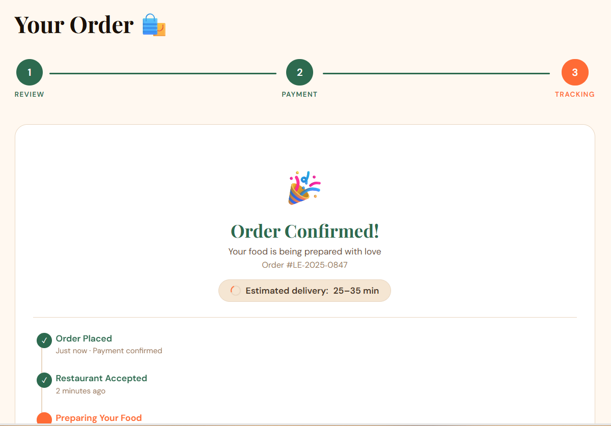

<p align="center">
  
</p>

# mealmap 🎯

## Basic Details

### Team Name: Girlizz

### Team Members
- Nisha Bharati - MES College of Engineering and Technology,Kunnukara.

### Hosted Project Link
https://tink-her-hack-flax.vercel.app

### Project Description
A smart web platform that helps users discover the top-rated restaurants near their location based on reviews, ratings, price range, and preferences. The website provides personalized recommendations and real-time location-based search to make dining decisions faster and easier.

### The Problem statement
People often struggle to find the best restaurants nearby due to scattered information across multiple apps, unreliable reviews, and lack of personalized recommendations. This leads to wasted time, poor dining choices, and inconvenience while searching for good food options.

### The Solution
The platform aggregates restaurant data into one easy-to-use website that shows the best nearby dining options using ratings, user preferences, and location services. It simplifies decision-making by offering filtered recommendations, reviews, and quick navigation to restaurants.

---

## Technical Details

### Technologies/Components Used

**For Software:**
- Languages used: HTML5, CSS3, JavaScript
- Frameworks used: React (for future expansion)
- Libraries used: Axios (for API calls), Leaflet (for maps)
- Tools used: VS Code, Git, Vercel, Node.js

**For Hardware:**
- Not applicable (Web-based project)

---

## Features

Key features of mealmap:

- **Real-time Location Detection:** GPS-based restaurant discovery within 3 km radius
- **Multi-language Support:** 8 languages including English, Hindi, Arabic, French, Chinese, Spanish, German, and Japanese
- **Budget Filter:** Customizable budget range (₹100 - ₹2000) per meal
- **Restaurant Ratings & Reviews:** Aggregated ratings from verified user reviews
- **Advanced Filtering:** Filter by cuisine type, price range, delivery time, and user ratings
- **User Authentication:** Secure email/password signup and social login (Google, Apple)
- **Personalized Recommendations:** AI-driven suggestions based on user preferences and history
- **Quick Navigation:** Direct links to restaurant websites, phone numbers, and directions

---

## Implementation

### For Software:

#### Installation
```bash
# Clone the repository
git clone https://github.com/nishabharati04/tink-her-hack.git
cd tink-her-hack

# Install dependencies
npm install

# Install additional packages
npm install axios leaflet react-leaflet
```

#### Run
```bash
# Development server
npm start

# Build for production
npm run build

# Deploy to Vercel
vercel deploy
```

---

## Project Documentation

### For Software:

#### Screenshots (Add at least 3)


*Login & Sign-up flow - User authentication with Google and Apple social login options*


*Language selection and GPS location setup - Multi-language support with automatic location detection*


*Restaurant discovery interface - Budget slider, filters, and nearby restaurant listings with ratings*

#### Diagrams

**System Architecture:**


*Frontend (React) communicates with REST API backend to fetch restaurant data, user preferences stored in database, location services via GPS/manual entry, and integrations with restaurant review platforms*

**Application Workflow:**


*User → Authentication → Language Selection → Location Setup → Budget Preference → Restaurant Feed → Restaurant Details → Booking/Navigation*

---

## Additional Documentation

### For Web Projects with Backend:

#### API Documentation

**Base URL:** -
##### Endpoints

**POST /api/auth/signup**
- **Description:** Register a new user account
- **Request Body:**
```json
{
  "name": "Nisha Bharati",
  "email": "nisha@example.com",
  "password": "securePassword123",
  "language": "en"
}
```
- **Response:**
```json
{
  "status": "success",
  "message": "Account created successfully",
  "userId": "user_12345",
  "token": "jwt_token_here"
}
```

**POST /api/auth/login**
- **Description:** Authenticate user with credentials
- **Request Body:**
```json
{
  "email": "nisha@example.com",
  "password": "securePassword123"
}
```
- **Response:**
```json
{
  "status": "success",
  "token": "jwt_token_here",
  "user": {
    "userId": "user_12345",
    "name": "Nisha Bharati",
    "email": "nisha@example.com"
  }
}
```

**POST /api/auth/social-login**
- **Description:** Login via Google or Apple OAuth
- **Request Body:**
```json
{
  "provider": "google",
  "token": "oauth_token_here"
}
```
- **Response:**
```json
{
  "status": "success",
  "token": "jwt_token_here",
  "user": {
    "userId": "user_12345",
    "name": "Nisha Bharati"
  }
}
```

**GET /api/restaurants/nearby**
- **Description:** Get restaurants near user location
- **Parameters:**
  - `latitude` (float): User's latitude
  - `longitude` (float): User's longitude
  - `radius` (integer): Search radius in km (default: 3)
  - `budget` (integer): Max budget in rupees
  - `cuisine` (string, optional): Cuisine type filter
- **Response:**
```json
{
  "status": "success",
  "data": [
    {
      "restaurantId": "rest_001",
      "name": "Spice Garden",
      "cuisine": "Indian",
      "rating": 4.5,
      "reviews": 245,
      "priceRange": "₹200-500",
      "distance": "1.2 km",
      "latitude": 9.9312,
      "longitude": 76.2673,
      "address": "Fort Kochi, Kerala",
      "phone": "+91-9876543210",
      "website": "https://spicegarden.com"
    }
  ]
}
```

**GET /api/restaurants/{restaurantId}**
- **Description:** Get detailed information about a restaurant
- **Parameters:**
  - `restaurantId` (string): Restaurant ID
- **Response:**
```json
{
  "status": "success",
  "data": {
    "restaurantId": "rest_001",
    "name": "Spice Garden",
    "cuisine": ["Indian", "Kerala"],
    "rating": 4.5,
    "totalReviews": 245,
    "priceRange": "₹200-500",
    "address": "Fort Kochi, Kerala",
    "phone": "+91-9876543210",
    "website": "https://spicegarden.com",
    "menu": ["https://menu1.jpg", "https://menu2.jpg"],
    "reviews": [
      {
        "userId": "user_456",
        "userName": "John Doe",
        "rating": 5,
        "comment": "Amazing food and ambiance!",
        "date": "2024-02-05"
      }
    ],
    "openingHours": "10:00 AM - 11:00 PM",
    "deliveryTime": "30-45 mins"
  }
}
```

**POST /api/restaurants/{restaurantId}/reviews**
- **Description:** Post a review for a restaurant
- **Request Body:**
```json
{
  "rating": 4,
  "comment": "Great food quality and fast service",
  "userId": "user_12345"
}
```
- **Response:**
```json
{
  "status": "success",
  "message": "Review posted successfully",
  "reviewId": "review_789"
}
```

**GET /api/users/preferences**
- **Description:** Get user's saved preferences
- **Parameters:**
  - `userId` (string): User ID
- **Response:**
```json
{
  "status": "success",
  "data": {
    "userId": "user_12345",
    "language": "en",
    "budget": 300,
    "preferredCuisines": ["Indian", "Italian"],
    "savedLocations": [
      {
        "name": "Home",
        "latitude": 9.9312,
        "longitude": 76.2673
      }
    ]
  }
}
```

**PUT /api/users/preferences**
- **Description:** Update user preferences
- **Request Body:**
```json
{
  "userId": "user_12345",
  "budget": 500,
  "preferredCuisines": ["Indian", "Italian", "Chinese"],
  "language": "hi"
}
```
- **Response:**
```json
{
  "status": "success",
  "message": "Preferences updated successfully"
}
```

**GET /api/search/restaurants**
- **Description:** Search restaurants by name or cuisine
- **Parameters:**
  - `query` (string): Search term
  - `latitude` (float): User latitude
  - `longitude` (float): User longitude
  - `sortBy` (string, optional): "rating", "distance", "price" (default: "rating")
- **Response:**
```json
{
  "status": "success",
  "data": [
    {
      "restaurantId": "rest_001",
      "name": "Spice Garden",
      "cuisine": "Indian",
      "rating": 4.5,
      "distance": "1.2 km"
    }
  ]
}
```

---

## Project Demo

### Video
https://drive.google.com/file/d/1IuyH5L_hfTRMdDNB8XDaVKYBytoJm6x-/view?usp=drive_link

*The video demonstrates the complete user journey: login/signup process, language selection, GPS location setup, budget customization, restaurant discovery with real-time filtering, and detailed restaurant information with reviews and navigation.*

### Additional Demos
- **Live Site:** https://tink-her-hack-flax.vercel.app

- **GitHub Repository:** https://github.com/Nishabharati04/tink-her-hack

---

## AI Tools Used (Optional - For Transparency Bonus)

**Tool Used:** GitHub Copilot

**Purpose:** Code generation and development assistance
- Generated boilerplate React components for authentication
- Assistance with API integration and error handling
- JavaScript function optimization for location services

**Key Prompts Used:**
- "Create a React component for multi-step form with progress indicators"
- "Write REST API endpoints for restaurant search with filtering"
- "Implement GPS location detection in JavaScript"

**Percentage of AI-generated code:** Approximately 25%

**Human Contributions:**
- UI/UX design and styling
- System architecture planning
- API endpoint design and logic
- Testing and debugging
- Database schema design
- Integration between frontend and backend

---

## Team Contributions

- **Nisha Bharati:** Full-stack development, UI/UX design, API integration, frontend implementation, project documentation

---

## License

This project is licensed under the MIT License - see the [LICENSE](LICENSE) file for details.

---

Made with ❤️ at TinkerHub
